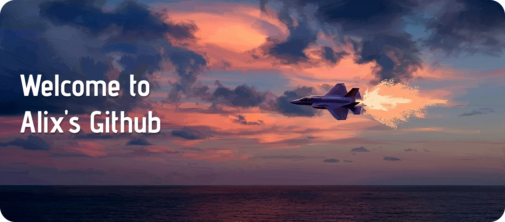

<div align="center">
  
</div>

<br/>

<!-- Typing animation -->
<div align="center">
  
</div>

<br/>

---


## 🧬 About Me

```typescript
const alix = {
  role:       "Frontend Developer",
  education:  "Ingeniería en TI e Innovación Digital @ UPChiapas",
  location:   "México 🇲🇽",
  focus:      ["UI/UX", "Web Apps", "Mobile Dev"],
  currentlyLearning: ["Next.js", "Kotlin + Jetpack Compose"],
  funFact:    "I design in Figma before I ever touch the code.",
  motto:      "Code is craft. Design is intention. Together they're magic.",
};
```
  


<br/>

---

## 🛠️ Tech Stack

<div align="center">

### 🎨 Frontend


### ⚙️ Backend & DB


### 📱 Mobile


### 🎨 Design


</div>

<br/>

---

## 📊 GitHub Stats

<div align="center">
  
  
</div>

<br/>

<div align="center">
  
</div>

<br/>

<!-- Snake animation -->
<div align="center">
  
</div>

<br/>

---

## 🚀 Featured Projects

<div align="center">
<a href="https://github.com/hornet3113/bonvoyage-frontend">
  
</a>
<br/><br/>
Show Image

Collaborative project — check it out on @LuisNafate's profile.

</div>
<br/>


---

## 🌐 Connect With Me

<div align="center">

[](https://linkedin.com/in/TU-USUARIO)
[](https://x.com/TU-USUARIO)

</div>

<br/>

---

<!-- Activity graph -->
<div align="center">
  
</div>

<br/>

<div align="center">
  
</div>

<br/>

<div align="center">
  <sub>✨ Crafted with code, caffeine & a bit of chaos — Alix Montesinos</sub>
</div>
